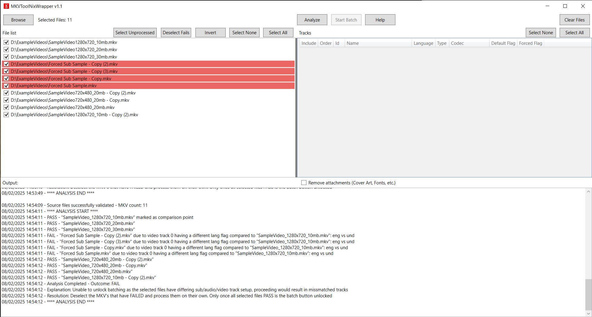
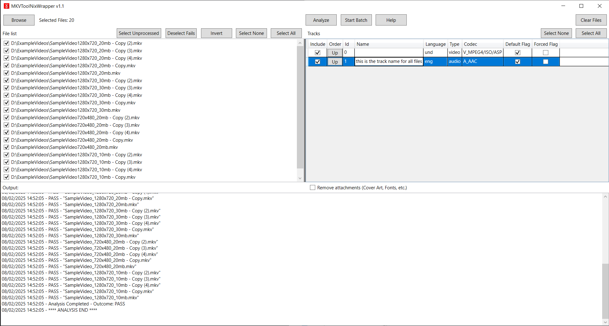
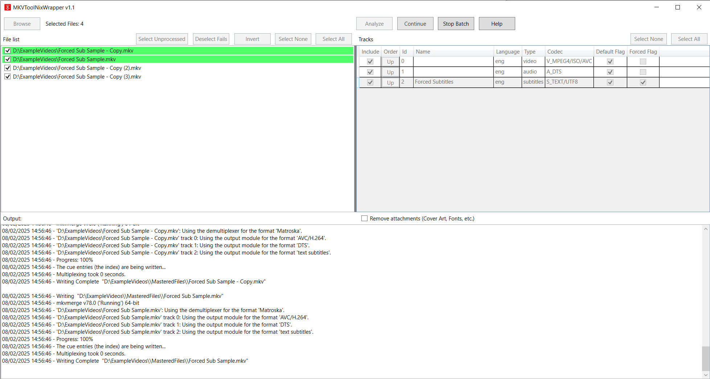

# **MKVToolNixWrapper - Batch Editor**

**MKVToolNixWrapper - Batch Editor** is a simple and efficient tool designed to make batch editing of `.MKV` files quick and easy. This tool leverages **mkvmerge.exe** (part of the MKVToolNix suite) to help users customize their `.MKV` files with minimal effort.

This project is a fork of [MKVToolNixWrapper](link-to-original-repo), developed by H3X1C.  
I made multiple key improvements listed below.

---

## **Key Features**
- **File Selection Made Easy**:  
   - Browse folders or drag and drop files/folders to quickly add `.MKV` files to the tool.  
   - Automatically filters out non-MKV files for your convenience.

- **Analyze File Compatibility**:  
   - Check if all selected files have the same audio, video, and subtitle tracks.  
   - Files with mismatched tracks are flagged in **red** and must be deselected before processing other files.

- **Customize Tracks**:  
   - Easily remove unwanted tracks with checkboxes.  
   - Reorder, rename, change language, and adjust **default** and **forced** flags for tracks.  
   - Supports editing of audio, subtitle, and video tracks.

- **Batch Processing**:  
   - Configure track settings and process all compatible files in one go.  
   - Output files are saved in the same directory in a newly created **`masteredfiles`** folder.  

- **Control the Process**:  
   - Pause, stop, or monitor progress using the built-in console window.  
   - The console provides real-time updates about file processing.

- **Restart Anytime**:  
   - Clear the last selected file list and start over with new selections effortlessly.

---

## **How It Works**
1. **Add Files**:  
   - Use the **Browse Folder** button or drag-and-drop files/folders into the tool.  
   - Only `.MKV` files will be listed for processing.

2. **Analyze Files**:  
   - Click the **Analyze** button to check if all files have identical track structures (audio, subtitles, video).  
   - Files that fail the analysis are marked in **red** and must be deselected to proceed.

3. **Edit Tracks**:  
   - Use the second table to:
     - **Remove Tracks**: Check the box to exclude a track.
     - **Reorder Tracks**: Change the track order by using the up button.
     - **Rename Tracks**: Give tracks custom names.
     - **Change Language**: Set the language of a track.
     - **Set Flags**: Mark tracks as **default** or **forced**.

4. **Batch Process Files**:  
   - Once all files are ready, click **Start Batch** to apply your settings.  
   - The processed files are saved in the `masteredfiles` folder and will always overwrite existing files(!).

5. **Monitor Progress**:  
   - Follow the progress in the console window at the bottom of the tool.  
   - Pause or stop the process at any time if needed.

6. **Repeat if Needed**:  
   - Clear the files list and start again with new files or settings.

---

## **Screenshots**
Here are a few examples of what the tool looks like in action:

  
  
  

---

## **Example Use Cases**
### **Scenario 1: Simplify Your Playback Experience**  
You have a series of `.MKV` files with multiple audio tracks (e.g., English dub, foreign language) and subtitles in various languages. You want:  
- To remove unwanted audio and subtitle tracks.  
- To set the default audio to **English**.  
- To mark English subtitles as both **default** and **forced**.
- To reorder the track list, to have your prefered language always listed at the top.

With MKVToolNixWrapper - Batch Editor, you can:  
1. Add all `.MKV` files to the tool.  
2. Remove unnecessary tracks using the checkboxes.  
3. Set the desired tracks as default and/or forced.  
4. Click **Start Batch** to save the customized files in the `masteredfiles` folder.  

The result:  
Smaller file sizes and playback that matches your preferences.

---

### **Scenario 2: Handle Inconsistent Track Layouts**  
You have a TV series where most episodes have the same track setup, but a few episodes differ in track names, count, or order.  

With MKVToolNixWrapper - Batch Editor, you can:  
1. Click **Analyze** to check for inconsistencies.  
2. Deselect the flagged (red) files to process the compatible ones first.  
3. Process the flagged files separately after resolving their differences.  

The result:  
Smooth batch processing, even when files vary.

---

## **Download**
[Download the latest version of MKVToolNixWrapper - Batch Editor](https://github.com/heateeee/MKVToolNixWrapper-BatchEditor/releases)

- Visit the **Releases** section for changelogs and older versions.  
- If you’re only interested in using the tool, download the **standalone executable**.

---

## **Disclaimer**
This tool is not affiliated with or endorsed by MKVToolNix. It is a standalone utility built to speed up and simplify the use of MKVToolNix tools like `mkvmerge.exe` and `mkvinfo.exe`.  

---
